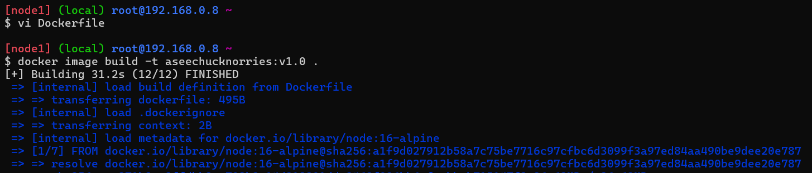
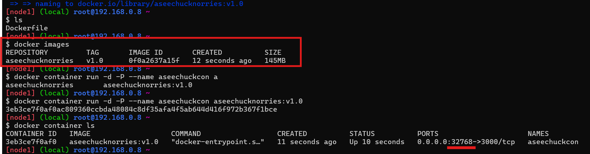
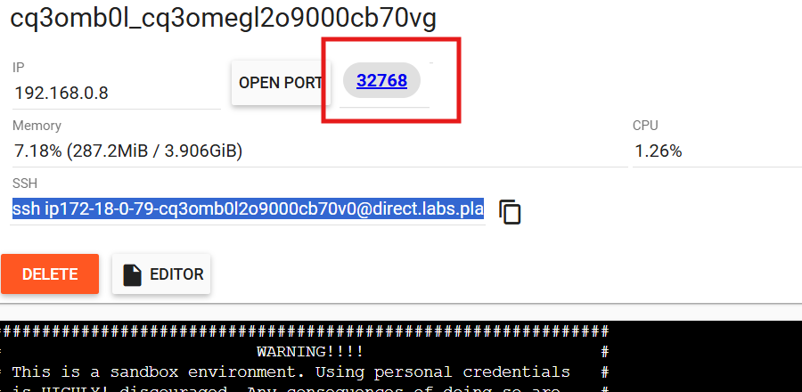
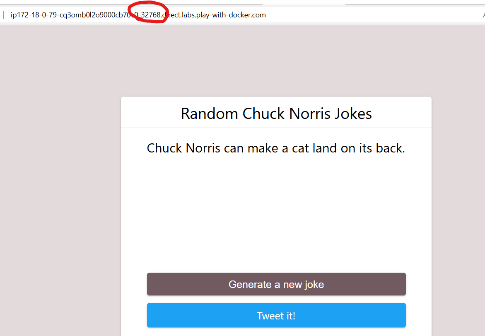
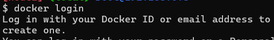
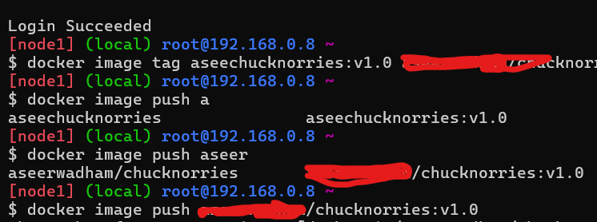
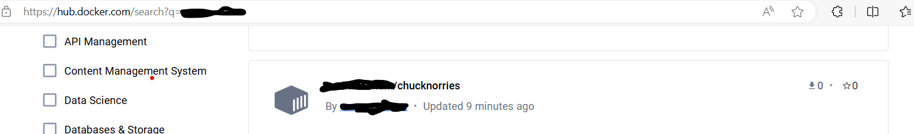
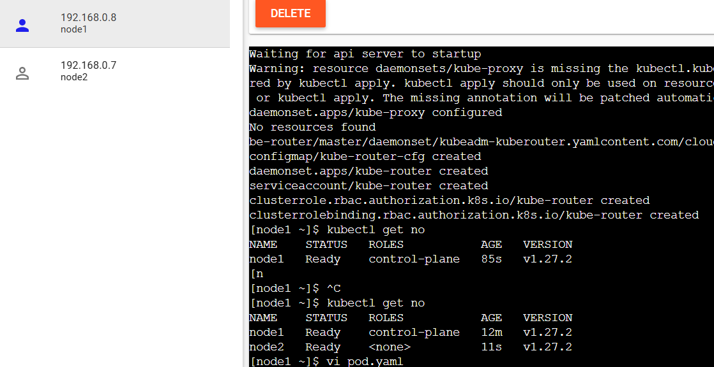
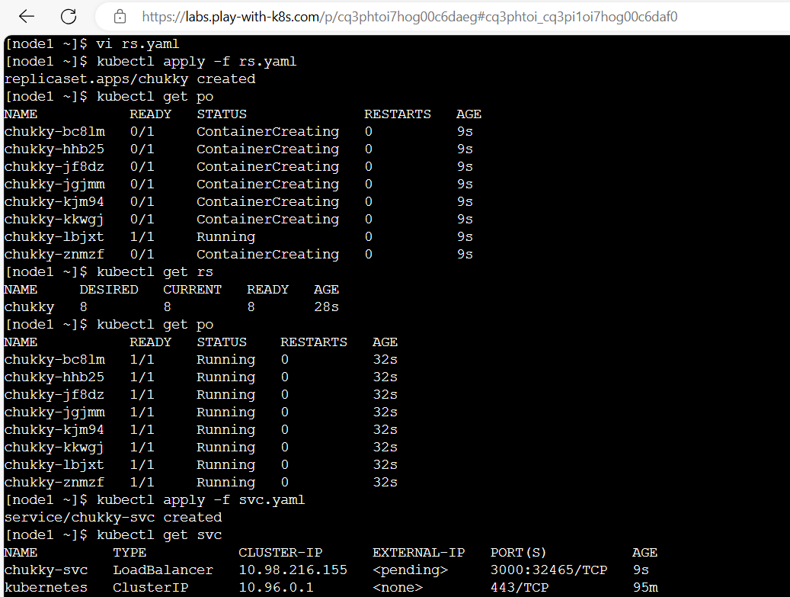
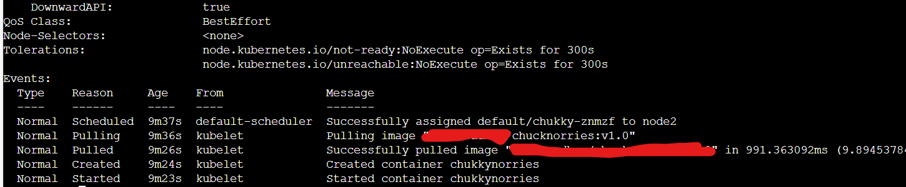

### Task: Clone_Build_Registry_Deploy:
-------------------------------------
1. Clone code ```https://github.com/betterstack-community/chucknorris```
2. Build Docker Image
3. Push to ECR Registry
4. Use Image in Pod Manifest
 
 * First, I tried the manual steps. then i got to know how to build and deploy our sample application, what are the required softwares to install for our application to work.

* [Refer Here](https://betterstack.com/community/guides/scaling-nodejs/dockerize-nodejs/) for the official documentaion.

# Dockerfile:
```Dockerfile
FROM node:16-alpine
WORKDIR /app
RUN apk add --no-cache git
RUN git clone https://github.com/betterstack-community/chucknorris.git
WORKDIR /app/chucknorris
RUN npm install
COPY . .
EXPOSE 3000
CMD ["npm", "start"]
```
* And then, build the image run the container 
* 
* I tried all the above steps in Docker playground, after that i try to connect by using docker assigned port number.
* 
* 
* 

* Whatever I created an docker image, that image pushed to dockerhub.
* 
* 
* 

* Later I used that image in kubernetes manifest files. Like I created Pod, ReplicaSet, Service., also i tried to scale up and scale down the pods.
* 
* 
* 
